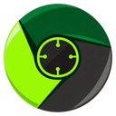

# ChromiumRTXCuda

Windows development fork of Chromium with native CUDA and RTX access behind a
normal website permission. The JavaScript API follows
[cuda-webshader](https://github.com/SamG-Coder/cuda-webshader)'s `GpuRuntime` design.
Public NVIDIA DLSS Super Resolution and DLAA are included; DLSS 5 is excluded.

See [the API, build instructions, demo, and current limitations](rtx_cuda/README.md).
This is an experimental native GPU integration for trusted development sites;
the GPU helper is not yet a hardened browser sandbox.

## Latest build: 0.1.0-alpha.6

[Release notes](https://github.com/SamG-Coder/ChromiumRTXCuda/releases/tag/v0.1.0-alpha.6) · [Download Windows x64 ZIP](https://github.com/SamG-Coder/ChromiumRTXCuda/releases/download/v0.1.0-alpha.6/ChromiumRTXCuda-0.1.0-alpha.6-windows-x64.zip) · [SHA-256 checksum](https://github.com/SamG-Coder/ChromiumRTXCuda/releases/download/v0.1.0-alpha.6/ChromiumRTXCuda-0.1.0-alpha.6-windows-x64.zip.sha256)

Extract the complete ZIP into a new folder and run **`chrome.exe`**.
`Start ChromiumRTXCuda.cmd` is optional: it uses a separate `profile` folder
beside the browser and skips first-run/default-browser prompts. Both entry
points support native CUDA and RTX.

This prerelease fixes newer-PTX rejection on older CUDA 13 drivers by compiling
ordinary CUDA kernels directly to device-specific CUBIN machine code. It retains
optimized native CUDA defaults with fast math and no
debug information, hardware-based CUDA grid limits, direct native canvas
presentation, and no wall-clock deadline for CUDA/OptiX shader compilation.

Try the [RTX Showcase](https://samg-coder.github.io/RTXShowcase/).

## Upstream Chromium

Chromium is an open-source browser project that aims to build a safer, faster,
and more stable way for all users to experience the web.

The project's web site is https://www.chromium.org.

To check out the source code locally, don't use `git clone`! Instead,
follow [the instructions on how to get the code](docs/get_the_code.md).

Documentation in the source is rooted in [docs/README.md](docs/README.md).

Learn how to [Get Around the Chromium Source Code Directory
Structure](https://www.chromium.org/developers/how-tos/getting-around-the-chrome-source-code).

For historical reasons, there are some small top level directories. Now the
guidance is that new top level directories are for product (e.g. Chrome,
Android WebView, Ash). Even if these products have multiple executables, the
code should be in subdirectories of the product.

If you found a bug, please file it at https://crbug.com/new.
